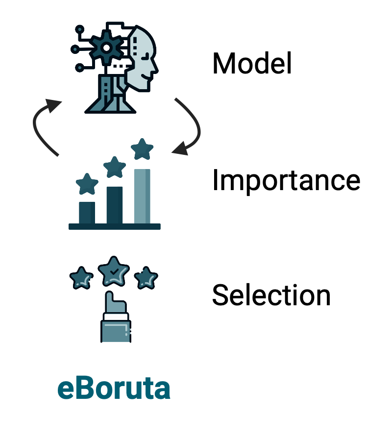
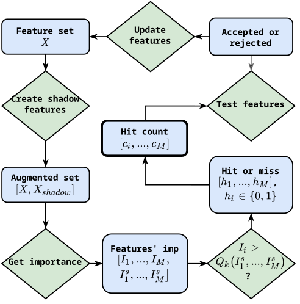

# *eBoruta* -- an *e*xtended *Boruta* algorithm

[](https://eboruta.readthedocs.io/en/latest/?badge=latest)
[](https://pypi.org/project/eBoruta)
[](https://pypi.org/project/eBoruta)
[](https://github.com/pypa/hatch)



## Introduction

Boruta is an "all-relevant" feature selection algorithm initially suggested for Random Forests [1]. It's categorized as a "wrapper" method since it uses an ML model to filter for features relevant to the model's learning objective. 

To decide what's relevant, Boruta first creates a copy of the data and scrambles the values, thus breaking the connection to the response variable. Such "shadow" features are used as a reference point to separate relevant variables from irrelevant ones. Indeed, if a real feature behaves in the same way as would random noise, it doesn't contribute anything useful, and one should consider discarding it.

Thus, Boruta is an iterative procedure. First, it trains the model on the dataset augmented by shadow features and computes feature importance values. It then checks the importance distribution for the shadow features and how real features relate to this distribution. If, given these data, Boruta can't tell the difference between real and shadow features, it assigns a "miss" to this feature in the current iteration. Otherwise, it assigns a "hit".

Accumulating "hits" and "misses," Boruta uses statistical testing to decide whether their composition at the current number of steps could have occurred by chance. Thus, Boruta accepts or rejects a feature consistently yielding  "hits" or "misses," resp. However, Boruta is not always confident about accepting or rejecting, leaving some features "tentative," i.e., requiring further testing. So the loop continues until reaching some set number of steps or accepting/rejecting the whole feature pool.



## Why making this library?

Indeed, two Python implementations already exist:
- [BorutaPy](https://github.com/scikit-learn-contrib/boruta_py)
- [BorutaShap](https://github.com/Ekeany/Boruta-Shap)

The first introduced modifications that improved the original algorithm, while the second allowed Boruta to use the [SHAP importance](https://shap.readthedocs.io/en/latest/) [2]. Cool! We combine these features into a more user-friendly, transparent, and flexible interface.

## So what is *extended*?

Despite `BorutaShap` existing for quite a while, not many people seem to have realized the benefit of using SHAP importance in Boruta. Namely, it makes the method model-agnostic. Indeed, the original publication likely picked RF since it's general purpose and provides an optimal balance between speed and accuracy. However, nothing in the algorithm itself would justify hard dependency on RF. While `BorutaShap` supports other ensemble models such as `XGBoost` or `LightGBM`, we explicitly state its potential to be fully model-agnostic. Hence, `eBoruta` supports any model as long as the method to compute the feature importance is defined. Want to try `SVM` with permutation importance? Go ahead! Neural networks? We've got you covered! To heck with it, why use a single model when it's known that there isn't a single one good for everything? With `eBoruta`, you can (and probably should) try various approaches.

Currently, 

## Installation

`eBoruta` is a pure Python package installable via pip:

```bash
pip install eboruta
```

## Usage

Below we present the simplest use case corresponding to the default RF-based algorithm.

```python
from eBoruta import eBoruta
from sklearn.datasets import make_classification

x, y = make_classification()

selector = eBoruta()
selector.fit(x, y)
```

However, you're encouraged to explore documentation [here](https://eboruta.readthedocs.io/en/latest/), more [usage examples](https://eboruta.readthedocs.io/en/latest/notebooks.html).

## Disclaimer

`eBoruta` is still undergoing development. Not all the model types were tested. We encourage you to raise an issue if you find a bug, an example where it fails, or you want to propose a new feature/interface improvement/whatever.

## References

[1] Miron B. Kursa and Witold R. Rudnicki. “Feature Selection with the Boruta Package”. In: Journal of Statistical Software 36.11 (2010), pp. 1–13.
[2] Scott Lundberg and Su-In Lee. “A Unified Approach to Interpreting Model Predictions”. In: arXiv (2017). eprint: 1705.07874.